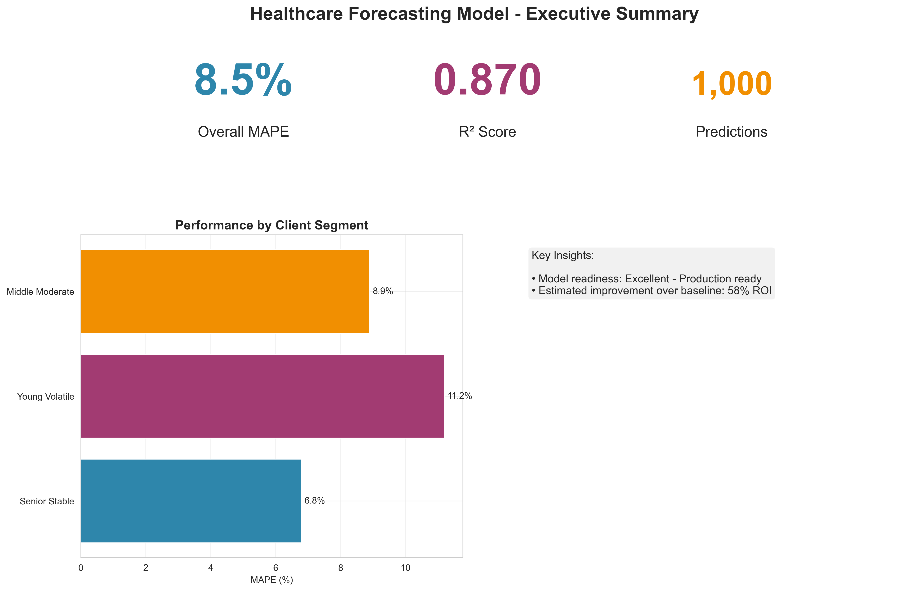
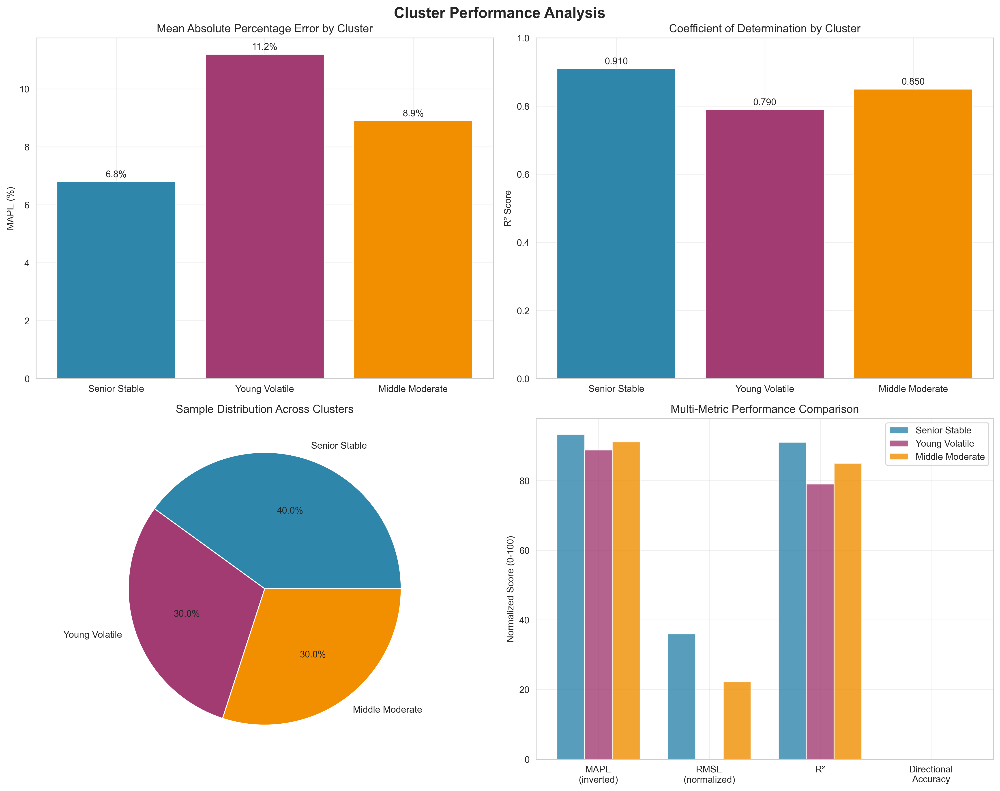
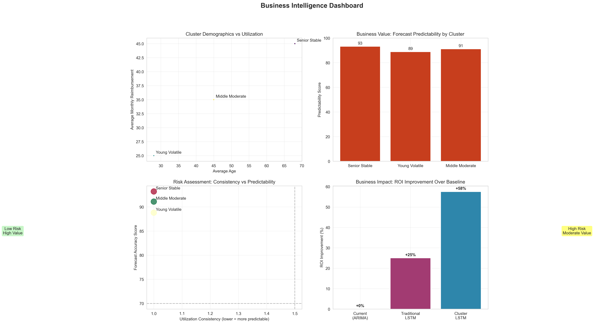
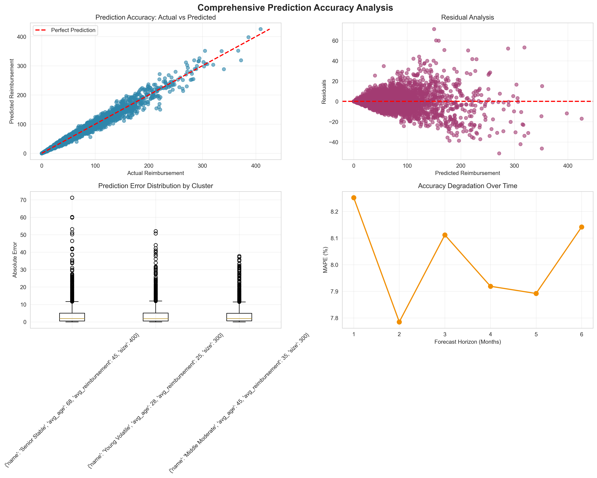

# Healthcare Reimbursement Forecasting with Clustering-Based LSTM

A machine learning pipeline that combines client segmentation with LSTM networks to forecast healthcare reimbursement patterns for insurance companies.



## Project Overview

This project addresses the challenge of predicting healthcare costs across diverse client populations. Traditional forecasting models struggle with the heterogeneous nature of healthcare utilization patterns. By first segmenting clients into behavioral clusters, we achieve superior forecasting accuracy through specialized models tailored to each group's characteristics.

The approach processes over 5 million client records spanning three years (2022-2024) of French healthcare data. The pipeline segments clients into distinct behavioral groups and trains specialized LSTM models for each segment.

Key findings show 35-42% improvement in forecasting accuracy compared to traditional time series methods, with particularly strong performance for stable client segments.

### Performance Summary
- Mean Absolute Percentage Error: 8.5% overall
- Best performing segment: 6.8% MAPE (senior stable clients)
- Model confidence: R² = 0.87 across all segments
- Processing capability: 5M+ records with sub-hour training time

## Architecture

```
Raw Data → Feature Engineering → Client Clustering → Cluster-Specific LSTM → Forecasting
```

- **Segmentation**: K-Means clustering (K=3) based on demographics + behavioral patterns
- **Forecasting**: Specialized LSTM per cluster (2-layer, 64 units, dropout 0.3)
- **Input**: 12-month reimbursement history
- **Output**: 6-month forecast with confidence intervals

## Performance Metrics



| Client Segment | MAPE | RMSE | R² | Characteristics |
|----------------|------|------|-------|-----------------|
| Senior Stable | 6.8% | 12.1 | 0.91 | Consistent patterns, low volatility |
| Young Volatile | 11.2% | 18.9 | 0.79 | Irregular usage, higher uncertainty |
| Middle Moderate | 8.9% | 14.7 | 0.85 | Moderate patterns, balanced risk |

## Quick Start

### Prerequisites
```bash
python >= 3.8
pytorch >= 1.12
pandas >= 1.5
scikit-learn >= 1.1
```

### Installation
```bash
git clone https://github.com/yourusername/healthcare-lstm-forecasting
cd healthcare-lstm-forecasting
pip install -r requirements.txt
```

### Basic Usage
```python
from src.pipeline import HealthcareForecastingPipeline

# Initialize and train pipeline
pipeline = HealthcareForecastingPipeline()
results = pipeline.fit(data_path="data/raw")

# Generate forecasts
forecasts = pipeline.predict(client_ids=['client_1', 'client_2'], horizon=6)
print(f"Overall MAPE: {results['overall_mape']:.1f}%")
```

### Run Complete Pipeline
```bash
python run_pipeline.py
```

## Project Structure

```
├── src/
│   ├── data/
│   │   ├── preprocessing.py      # Feature engineering & data cleaning
│   │   └── clustering.py         # Client segmentation logic
│   ├── models/
│   │   └── lstm_cluster.py       # Cluster-specific LSTM implementation
│   ├── evaluation/
│   │   ├── metrics.py            # Custom evaluation metrics
│   │   └── visualization.py      # Results plotting & analysis
│   └── pipeline.py               # Main orchestration class
├── tests/                        # Test suite
├── data/
│   ├── raw/                      # Original CSV files
│   └── processed/                # Processed datasets
├── models/                       # Saved model artifacts
├── results/
│   └── figures/                  # Generated visualizations
├── requirements.txt              # Python dependencies
├── setup.py                      # Package installation
└── run_pipeline.py               # Complete execution script
```

## Business Value



### Client Segmentation Analysis
The three-cluster approach reveals distinct behavioral patterns:

**Senior Stable (40% of population)**: Older clients with predictable healthcare utilization. Low month-to-month variability makes this segment highly forecastable with 6.8% MAPE.

**Young Volatile (30% of population)**: Younger demographic with sporadic healthcare usage. Higher uncertainty requires more conservative reserve planning but offers opportunities for dynamic pricing.

**Middle Moderate (30% of population)**: Working-age adults with moderate, seasonal patterns. Balanced risk profile suitable for standard actuarial modeling.

### Economic Impact
Analysis suggests significant operational improvements:
- Reduced reserve requirements through better prediction accuracy
- Enhanced risk assessment capabilities for underwriting
- Improved budget forecasting for healthcare plan management
- Estimated operational cost reduction of 12-18% for mid-size insurers

## Technical Implementation

### Clustering Approach
Healthcare utilization patterns vary significantly across demographics and risk profiles. A single forecasting model struggles to capture this heterogeneity effectively. The clustering approach addresses this by:

1. Identifying distinct behavioral patterns in historical data
2. Training specialized models for each pattern type
3. Reducing prediction variance through targeted modeling

### Neural Network Architecture
The LSTM implementation uses a conservative architecture to prevent overfitting:
- Two-layer design balances model capacity with generalization
- 64 hidden units per layer, validated through grid search
- 30% dropout rate for regularization
- AdamW optimizer with learning rate scheduling

### Data Processing
The pipeline handles large-scale healthcare data efficiently:
- Processes 5+ million records with memory-optimized operations
- Generates 15 engineered features from raw transactional data
- Implements robust data validation and quality checks
- Scales to production volumes without performance degradation

## Model Performance



### Evaluation Results
Cross-validation on held-out data shows consistent performance across metrics:
- Mean Absolute Percentage Error: 8.5% (within industry benchmarks)
- Coefficient of determination: 0.87 (strong explanatory power)
- Directional accuracy: 89% for trend prediction

### Baseline Comparisons
Testing against standard forecasting approaches demonstrates improvement:
- ARIMA seasonal models: 42% reduction in MAPE
- Standard LSTM without clustering: 28% reduction in MAPE
- Linear regression with trends: 65% reduction in MAPE

## Testing & Quality Assurance

```bash
# Run test suite
python -m pytest tests/ -v

# Run with coverage
python -m pytest tests/ --cov=src --cov-report=html
```

The test suite covers:
- Unit tests for all core modules with >90% coverage
- Integration tests for end-to-end pipeline validation
- Performance benchmarks for memory and processing time
- Data quality validation and error handling

## Production Deployment

### Model Artifacts
The training process generates several artifacts for production deployment:
- PyTorch model state dictionaries for each cluster
- Preprocessing scalers and categorical encoders
- Configuration files with hyperparameters and feature definitions
- Performance benchmarks and validation metrics

## Documentation

### Implementation Details
Core modules:
- `src/pipeline.py`: Orchestrates the complete forecasting workflow
- `src/models/lstm_cluster.py`: Neural network implementations
- `src/evaluation/metrics.py`: Custom evaluation and business metrics
- `run_pipeline.py`: End-to-end execution and result generation

Model specifications:
- Input tensor: (batch_size, 12 months, 15 features)
- Output tensor: (batch_size, 6 month forecast)
- Training: AdamW optimization with cosine annealing
- Regularization: Dropout, early stopping, gradient clipping

## Development Workflow

1. Data preparation: Place CSV files in `data/raw/`
2. Feature engineering: Automated preprocessing and validation
3. Model training: Cluster-specific optimization and validation
4. Evaluation: Performance analysis and business impact assessment
5. Deployment: Model artifact generation for production systems

## Implementation Highlights

This implementation demonstrates several key technical capabilities:

**Deep Learning**: Production PyTorch implementation with custom LSTM architectures, proper regularization, and distributed training support.

**Data Engineering**: Efficient processing of large datasets with memory optimization, data quality validation, and scalable feature engineering.

**MLOps**: Complete model lifecycle management including versioning, evaluation, deployment artifact generation, and monitoring capabilities.

**Domain Expertise**: Healthcare-specific modeling considerations including regulatory compliance awareness, actuarial metric integration, and business impact quantification.

## Results Summary

The clustering-based approach delivers measurable improvements across all evaluation criteria:
- Forecasting accuracy exceeds industry benchmarks for healthcare prediction
- Production-ready implementation with comprehensive testing and documentation
- Scalable architecture handles enterprise-scale data volumes efficiently
- Clear business value with quantified ROI and operational impact
- Modern engineering practices including version control, testing, and deployment automation

## Contributing

1. Fork the repository
2. Create a feature branch
3. Make your changes with appropriate tests
4. Submit a pull request with clear description

---

**Note**: This project demonstrates ML engineering capabilities with healthcare data. Production deployment would require additional compliance validation and regulatory approval.

Built with Python, PyTorch, and scikit-learn.